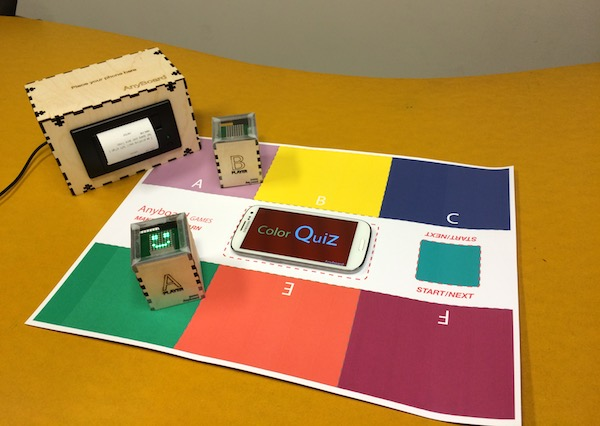
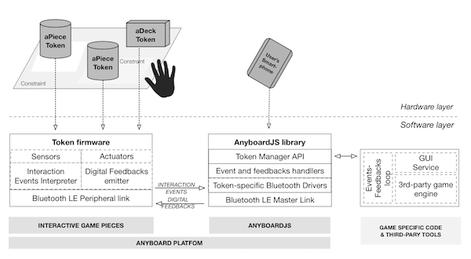
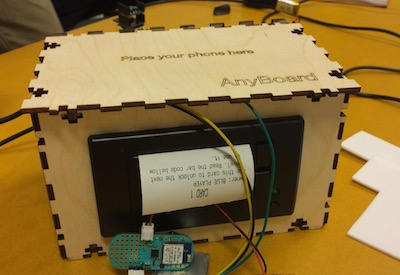
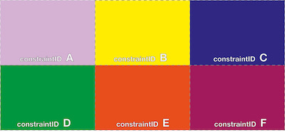
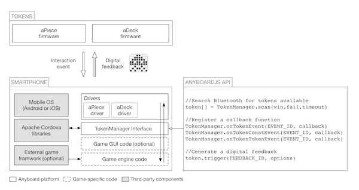

# Anyboard: A platform for making and play hybrid Board Game Platform

Making hybrid board games that mix the interactivity of video games with the social impact of board games is challenging. While the design process needs to take into account elements from the digital and analog domains, building prototypes requires dealing with diverse technologies in the field of Tangible Interfaces and Interactive Tabletop and Surfaces. 

*Anyboard* is an innovative platform to make and play hybrid board games. Anyboard games blend the social impact of traditional board games with the interactivity of video games. 

Our platform provides theoretical tools to map traditional board game interaction to the hybrid medium and lightweight technology tools to facilitate game prototyping. Our platform provides augmented game pieces that work with traditional cardboards, allowing designers to easily build collaborative interactive games without requiring engineering skills.

For furter references and details please read:
S. Mora, T. Fagerbekk, M. Monnier, E. Schroeder and M. Divitini. “Anyboard: a Platform for Hybrid Board Games”. In proceedings of the International Conference on Entertainment Computing (ICEC), 2016. [preprint](https://dl.dropboxusercontent.com/u/4495822/Papers/Papers/Anyboard_ICEC_preprint.pdf)

Anyboard is released under [Apache 2.0 license](https://tldrlegal.com/license/apache-license-2.0-(apache-2.0)).

# Anyboard fundamentals

The platform supports the development of interactive board games with design and prototyping tools. 

- Anyboard *Design Entities* help modelling players' interaction with technology-augmented game pieces, facilitating mapping game rules with mechanics and helping the transition between design and implementation. 
- Anyboard software and hardware tools support prototype development with 
  1. *Interactive game tokens and cardboard templates* to support the construction of the game hardware. The tokens are generic enough to be reused across different games
  2. *AnyboardJS* A software library to facilitate the coding of games by abstracting the complexity of dealing with hardware and lowlevel programming. The library is designed to be packaged as smartphone app. Rather than being a primary means of interaction, in our platform the smartphone runs the game engine and provide an administration interface. 
  
## Design entities
  
Anyboard Design entities constitute the foundation of a language to model interaction styles with hybrid board games. They are derived from the [ITo approach](http://link.springer.com/chapter/10.1007/978-3-319-26005-1_10) and are mapped to traditional board game elements.

| Anyboard Design Entities | Traditional Board Game Elements |
|:------------------------:|:-------------------------------:|
| Tokens | Game Pieces |
| Constraints | Board tiles or sockets |
| Interaction Events | Player's actions |

- *Tokens* are technology-augmented artifacts which resemble traditional game pieces; ranging from elements of chance (e.g. an augmented dice in *Backgammon* or RFID-enabled cards in *Monopoly*) to game pieces, e.g. pawns augmented with an LCD displaying the player’s rank in the game.
- *Constraints* are either visual or physical confining regions in the board space. The association or dissociation of a token within a constraint can be mapped to digital operations to activate game dynamics. Examples of constraints are checks for Chess pieces and territories in Risk.
- *Interaction events* are player-triggered manipulations of tokens, that mod- ify the (digital and physical) state of a game. We define three types of events:
  * *Token Event (TE)*: the manipulation of a single token on, over around the board; e.g. the action of rolling a dice or drawing a card
  * *Token-Constraint Event (TCE)*: the operation of building transient token- constraint associations by adding or removing tokens to a constrained region of the board; e.g. moving army pieces beyond a territory line as an attack action
  * *Token-Token Event (TTE)*: the operation of building transient token-token adjacency relationships, achieved by moving tokens on the board; e.g. moving a token next to another token to exchange a resource between two players.

An Anyboard game can be therefore defined as a sequence of player-initiated interaction events that modify spatial configurations of tokens with respect to board constraints and other tokens. As a consequence tokens’ intangible (digital feedbacks) representations are updated.
Sequences of interaction events describe players’ actions during the game and are mapped to specific game dynamics implemented in a game engine.
The game engine connects and exchange data with tokens using the AnyboardJS library running on the user’s smartphone, for example activating specific game mechanics according with interaction events sensed by tokens or triggering digital feedbacks.

## Intearactive game tokens and cardboard template

Anyboard currently prototypes two different types of interactive tokens: aPawn, an augmented game piece, and aDeck, an augmented card deck. Being two of the most common elements of board game they can be used to implement a wide range of games.

### aPawn

*aPawns* are a technology-augmented version of pawn pieces commonly found in most games. They are capable of capturing the set of interaction events and produce digital feedbacks. More information on the [aPawn page]().

### aDeck

*aDeck* is an interactive version of the card deck commonly found in board games. Instead of holding stacks of cards, aDeck prints out its own cards using a small thermal printer. More information on the [aDeck page]()

### Cardboard templates

The cardboard template provides support to create custom cardboards that interact with aPawn tokens. aPawns use color temperature sensing to implement constraint regions. We therefore selected nine colors that provided satisfactory sensor recognition rate across different materials and printing techniques and associate them with unique IDs to be used in game development. A color palette to draw cardboard with custom constraint regions is provided as a template file that can be modified with vector graphic editors.

## AnyboardJS library

AnyboardJS library is a javascript library providing developer-friendly interface between the interactive tokens pand game-specific code developed with or without third-party game engines and running in a smartphone app. 

AnyboardJS provides two main functions. 

1. It establishes wireless links with aPawn and aDeck enabling data exchange using specific drivers for each type of token. 
2. It provides a TokenManager interface to enable developers to easily write javascript code to handle interaction events from tokens and generate digital feedbacks, to implement game-specific routines. The library is designed to be extensible, support to new interactive tokens can be added by writing driver modules. 

Although tokens are the primary user interface with a game, it is possible to code a secondary GUI to display extended informaion and controls on the smartphone screen; e.g. to be used to edit game settings, to display game rules and leader-boards. This functionality can be implemented with external libraries (e.g. jQuery mobile1).

A subset of the TokenManager interface functions is provided in Figure. For more information see [AnyboardJS page]()

# How to make an Anyboard Game

TBD

# Example games

See [Games page]().

