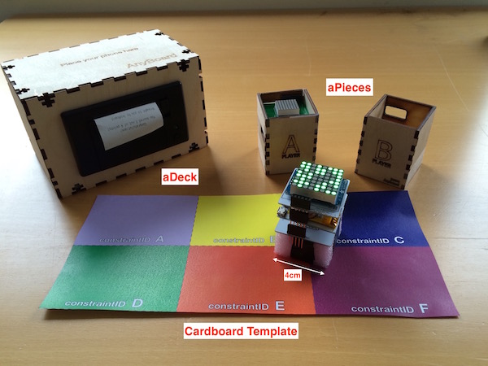

# Anyboard Interactive Board Game Platform

Making hybrid board games that mix the interactivity of video games with the social impact of board games is challenging. While the design process needs to take into account elements from the digital and analog domains, building prototypes requires dealing with diverse technologies in the field of Tangible Interfaces and Interactive Tabletop and Surfaces. 

*Anyboard* is an innovative platform to make and play interactive board games. Anyboard games blend the social impact of traditional board games with the interactivity of video games. Our platform provides theoretical tools to map traditional board game interaction to the hybrid medium and lightweight technology tools to facilitate game prototyping. Our platform provides augmented game pieces that work with traditional cardboards, allowing designers to easily build collaborative interactive games without requiring engineering skills.

For furter references and details please read:
S. Mora, T. Fagerbekk, M. Monnier, E. Schroeder and M. Divitini. “Anyboard: a Platform for Hybrid Board Games”. In proceedings of the International Conference on Entertainment Computing (ICEC), 2016. [preprint](https://dl.dropboxusercontent.com/u/4495822/Papers/Papers/Anyboard_ICEC_preprint.pdf)

Anyboard is released under [Apache 2.0 license](https://tldrlegal.com/license/apache-license-2.0-(apache-2.0)).

# Anyboard fundamentals

