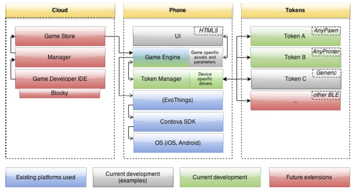

# Anyboard

## Overall Architecture

Communication Protocol in use [ASCII](https://docs.google.com/spreadsheets/d/1PqcmD4IRTpB7P-OFMh9d7eEE6F2ZAORWQ02E-gsUut0/edit?usp=sharing) -  [Binary](https://docs.google.com/spreadsheets/d/1ma2AnFMcsHt9IDDLVLB10V0-0mOVHH7EsZGv8Osqqr0/edit#gid=0)

## Directory list

* Cloud - FUTURE WORK
* Phone - See [https://github.com/tomfa/anyboard-lib](https://github.com/tomfa/anyboard-lib) for current implementation
* Tokens - Work in Progress, some example tagged BEANH are based on Lightblue Bean hardware and need to be ported to RFDUINO ardure, more below..

