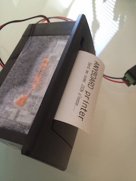

# Anyboard Tokens
This repository contains the firmware for the AnyBoard interactive game tokens.
Two game tokens are currenty under development: pawn and cards printer.

## firmware
The folder *pawn* and *printer* contains the RFduino program of the interactive tokens. The *libraries* folder contains four libraries that have to be copied and pasted in the Arduino's *libraries* folder.

## demo_application_evothings
See [demo app](../games/demo-app) for a simple demonstrator of the capabilities of the tokens. In order to use this application, follow this [tutorial](https://evothings.com/getting-started-with-evothings-studio-in-90-seconds/)

##License
See the licencse.txt file for license rights and limitations (Apache V2.0).

# Pawn Token

* RFduino ([website](http://www.rfduino.com/), [GitHub](https://github.com/RFduino/RFduino))
* Accelerometer ADXL345 ([datasheet](http://www.analog.com/media/en/technical-documentation/data-sheets/ADXL345.pdf))
* Vibrating motor ([datasheet](https://www.sparkfun.com/datasheets/Robotics/310-101_datasheet.pdf))
* Color detection sensor TCS347254 ([datasheet](https://www.adafruit.com/datasheets/TCS34725.pdf))
* Capacitive sensor MPR121 ([datasheet](https://www.sparkfun.com/datasheets/Components/MPR121.pdf))
* LED display ([datasheet](https://www.sparkfun.com/datasheets/Components/MPR121.pdf), [Adafruit product](https://www.adafruit.com/products/870))

## libraries
In order to use all the components listed in the hardware part, some Adafruit's and support libraries have been used. You can find these libraries in the *libraries* folder. Refer to the [manual installation section in the official Arduino library guide](https://www.arduino.cc/en/Guide/Libraries#toc5) to install the libraries on your system.

### Adafruit_ADXL345
For the ADXL345 the Adafruit_ADXL345 Arduino's library is used ([Adafruit_ADXL345](https://github.com/adafruit/Adafruit_ADXL345)). 

### Adafruit_Sensor
The Adafruit_ADXL345 library is based on the Adafruit's Unified Sensor Library ([Adafruit_Sensor](https://github.com/adafruit/Adafruit_Sensor)).

### Adafruit_MPR121
For the MPR121 the Adafruit_MPR121 Arduino's library is used ([Adafruit_MPR121](https://github.com/adafruit/Adafruit_MPR121_Library))

### Adafruit_TCS34725	
For the TCS34725 used with an autorage mechanism the Adafruit library is used ([Adafruit_TCS34725](https://github.com/adafruit/Adafruit_TCS34725/tree/master/examples/tcs34725autorange))

### Adafruit_GFX
For the LED display the Adafruit_GFX library is used ([Adafruit_GFX](https://github.com/adafruit/Adafruit-GFX-Library))

### Adafruit_LED_backpack
And the Adafruit_lED_backpack library is also required ([Adafruit_lED_backpack](https://github.com/adafruit/Adafruit-LED-Backpack-Library))

# Printer Token

#### Hardware
* [Bean](http://legacy.punchthrough.com/bean/) *Temporaney, this will be replaced by RFDUINO*
* Mini Thermal Printer - [specs](https://www.adafruit.com/products/597) - [tutorial](https://learn.adafruit.com/mini-thermal-receipt-printer)
* Power adapter

#### Software
* Arduino IDE
* Arduino JSON - [link](https://github.com/bblanchon/ArduinoJson)
* Adafruit Thermal_Library - [link](https://github.com/adafruit/Adafruit-Thermal-Printer-Library)

