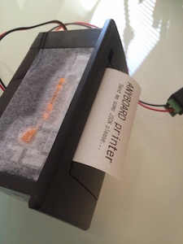

## Token Specs Prototype#1

### Pawn

#### Hardware
* [RFDUINO](http://www.rfduino.com)
* RGB Color Sensor - [specs](https://www.adafruit.com/products/1356) - [tutorial](https://learn.adafruit.com/adafruit-color-sensors) 
* RGB LED
* 850Mha LiPo Battery

#### Software
* Arduino IDE
* Arduino JSON - [link](https://github.com/bblanchon/ArduinoJson)
* Color Sensor Library - [link](https://github.com/adafruit/Adafruit_TCS34725)

### Printer

#### Hardware
* [Bean](http://legacy.punchthrough.com/bean/) *Temporaney, this will be replaced by RFDUINO*
* Mini Thermal Printer - [specs](https://www.adafruit.com/products/597) - [tutorial](https://learn.adafruit.com/mini-thermal-receipt-printer)
* Power adapter

#### Software
* Arduino IDE
* Arduino JSON - [link](https://github.com/bblanchon/ArduinoJson)
* Adafruit Thermal_Library - [link](https://github.com/adafruit/Adafruit-Thermal-Printer-Library)